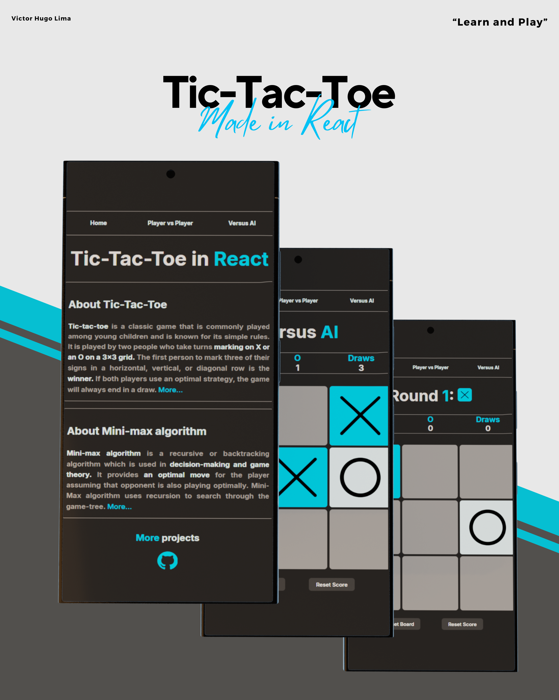

# Tic-Tac-Toe with React

---

  

---

> This implementation integrates a `Minimax algorithm` and has the possibility of Player Versus Player in a local game.  
> You can play the game in [my CodeSandbox](https://codesandbox.io/p/github/Gannicos/Tic-Tac-Toe/main?import=true).
